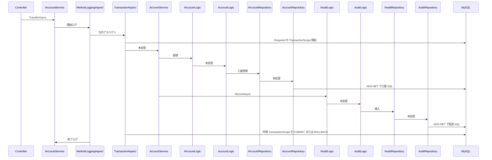

# ASP.NET Aspect 基盤

## 目的

ASP.NET 上で Spring の Aspect に近い形のアスペクト指向を実現する。Proxy パターンと Attribute を使い、サンプルとして Transactional とメソッド開始・終了ログを提供する。

## 前提

- 言語は C# 14、フレームワークは .NET 10 とする。
- 説明、コメント、操作説明書は日本語で書く。
- 仕組み本体は [AspnetAspect/AspnetAspect/AspnetAspect.csproj](../../AspnetAspect/AspnetAspect/AspnetAspect.csproj) に置く。DB には依存しない。
- サンプルは [AspnetAspect/AspectSample](../../AspnetAspect/AspectSample) に置く。
- プロキシは `System.Reflection.DispatchProxy` を使う。追加パッケージは不要。対象はインタフェースのみとする。
- AspectSample の構成はレイアードアーキテクチャとする。
- レイヤ間の呼び出しは次のとおりとする。
  - 許可: Controller → Service、Service → Logic、Logic → Repository、Logic → Logic
  - 禁止: Service → Service、Logic → Service、Repository から上位レイヤへの呼び出し
- Service、Logic、Repository の依存関係は、いずれもコンストラクタインジェクションで受け取る。
- アスペクトの対象は Service に限らない。Logic、Repository も、インタフェース経由で呼ばれるメソッドに Attribute を付ければ対象にできる。
- データアクセスは ADO.NET（`DbConnection`、`DbCommand`、`DbParameter` など）で行う。ドライバは MySqlConnector を使う。
- トランザクションの伝播は `System.Transactions.TransactionScope` で表現する。独自の TransactionManager などは作らない。
- 計画に書いていない設計判断は、実装前に必ず確認する。

## タスク

- [ ] AspnetAspect に、DispatchProxy、AspectAttribute、IAspect、AspectContext、Scoped / Singleton / Transient 用のプロキシ DI 拡張を追加する
- [ ] AspectSample に、LogAttribute、MethodLoggingAspect、Transactional 関連（TransactionScope）を追加する
- [ ] docker-compose.yml、初期化 SQL、[docs/mysql.md](../../docs/mysql.md) を作成する
- [ ] AspectSample に、口座振替の Controller / Service / Logic / Repository、Account 画面、DI 登録、接続文字列を追加する
- [ ] ブラウザで、正常振替、ロールバック、RequiresNew、ログ出力を確認する

## アスペクトの動作

### いつ動くか

- メソッドに対応する Attribute があるとき、その Attribute に紐づくアスペクトを実行する。
- メソッドに Attribute がなければ、クラスに付いた Attribute を使う。
- どちらにもなければ、そのアスペクトは実行しない。
- 呼び出しはインタフェース経由に限る。Service、Logic、Repository いずれも、実装クラスではなく登録したインタフェース型で注入して呼ぶ。同一クラス内から自分自身を直接呼ぶ場合はプロキシを通らない。

### 複数アスペクトの順序

- 1 回のメソッド呼び出しで複数のアスペクトが有効になるとき、`IAspect.Order` の値で並べる。値が小さいほど外側（先に開始し、後に終了する側）とする。
- サンプルでは、ログをトランザクションより外側にする。`MethodLoggingAspect` の `Order` を `TransactionAspect` より小さく設定する。

### Transactional の動き

- `TransactionAspect` は、Attribute の伝播に応じて `TransactionScope` を生成する。
- `Required` は `TransactionScopeOption.Required` とする。外側のスコープがあるときは参加し、内側の `Complete()` だけでは外側を確定しない。
- `RequiresNew` は `TransactionScopeOption.RequiresNew` とする。外側とは別の環境トランザクションとなる。
- スコープを `using` で囲み、正常終了時に `Complete()` を呼ぶ。例外時は `Complete()` せず rollback とする。例外は再スローする。
- Repository 内では `appsettings.json` の接続文字列から `MySqlConnection`（`DbConnection`）を開き、`DbCommand` で SQL を実行する。接続はアンビエントトランザクション（`TransactionScope`）に自動参加させる。

## 呼び出しの流れ（振替の例）



- 図の `IAccountService` 側の `MethodLoggingAspect` と `TransactionAspect` は、`AccountService` に `[Log]` と `[Transactional]` があるため動く。
- `IAuditLogic.RecordAsync` には `[Transactional(Propagation = RequiresNew)]` を付ける。`TransactionAspect` が `RequiresNew` の `TransactionScope` を張る。監査 SQL はそのスコープ内で確定する（図では内側スコープの commit / rollback は省略している）。
- `IAccountRepository` や `IAuditRepository` にも Attribute を付ければ、Repository 層のメソッド呼び出しもアスペクトの対象になる。

## ライブラリ（AspnetAspect）

[AspnetAspect/AspnetAspect/AspnetAspect.csproj](../../AspnetAspect/AspnetAspect/AspnetAspect.csproj) に `Microsoft.Extensions.DependencyInjection.Abstractions`（10.0 系）を追加する。

| ファイル | 内容 |
|----------|------|
| `Aspects/AspectAttribute.cs` | 基底 Attribute。`Class` と `Method` に付与可能。`Inherited = true` |
| `Aspects/IAspect.cs` | `AttributeType`、`Order`、`InvokeAsync` |
| `Aspects/AspectContext.cs` | 対象メソッド、実装インスタンス、引数、有効な Attribute |
| `Aspects/AspectNext.cs` | 次の処理へ進む delegate |
| `Proxy/AspectDispatchProxy.cs` | インタフェース呼び出しを横取りし、有効なアスペクトを連鎖する。`Task` / `Task<T>` / 同期戻り値に対応 |
| `DependencyInjection/AspectServiceCollectionExtensions.cs` | プロキシ登録の拡張メソッド |

### プロキシ登録

プロキシごとに、インタフェースと実装の対応を登録する。寿命は `ServiceLifetime` 引数では渡さず、次の 3 つの拡張メソッドのいずれかを使う。

| 拡張メソッド | DI の寿命 |
|--------------|-----------|
| `AddScopedAspectProxy<TInterface, TImplementation>()` | Scoped |
| `AddSingletonAspectProxy<TInterface, TImplementation>()` | Singleton |
| `AddTransientAspectProxy<TInterface, TImplementation>()` | Transient |

3 メソッドとも、実装型を表の寿命で登録し、インタフェース解決時にプロキシを返す。Service、Logic、Repository いずれのインタフェースにも使える。

AspectSample では、HTTP リクエスト単位でトランザクションを共有するため、次のとおり **すべて Scoped** で登録する。

```csharp
services.AddScoped<MethodLoggingAspect>();
services.AddScoped<TransactionAspect>();

services.AddScopedAspectProxy<IAccountService, AccountService>();
services.AddScopedAspectProxy<IAccountLogic, AccountLogic>();
services.AddScopedAspectProxy<IAuditLogic, AuditLogic>();
services.AddScopedAspectProxy<IAccountRepository, AccountRepository>();
services.AddScopedAspectProxy<IAuditRepository, AuditRepository>();
```

Singleton や Transient のプロキシが必要な型は、上記 3 メソッドのうち対応するものを選ぶ。AspectSample の振替デモでは Scoped 以外は使わない。

- アスペクトの実体は通常の DI 登録とする。プロキシは、DI に登録された `IAspect` 実装のうち、Attribute が一致するものだけを使う。
- どのアスペクトを有効にするかは、実装クラスやメソッドに付ける Attribute で決める。

## AspectSample の構成

### アスペクト関連

| ファイル | 内容 |
|----------|------|
| `Aspects/LogAttribute.cs` | ログ用 Attribute |
| `Aspects/MethodLoggingAspect.cs` | `ILogger` で開始・終了を出力。例外時も終了ログのあと再スロー |
| `Aspects/TransactionPropagation.cs` | `Required`、`RequiresNew` |
| `Aspects/TransactionalAttribute.cs` | `Propagation` プロパティ。既定値は `Required` |
| `Aspects/TransactionAspect.cs` | `TransactionScope` による Required / RequiresNew を実装 |

Repository はコンストラクタで `IConfiguration` を受け取り、接続文字列キー `ConnectionStrings:AspectSample` から `MySqlConnection` を生成する。SQL は `DbCommand` で実行する。トランザクション境界は `TransactionAspect` が張る `TransactionScope` に委ねる。

### レイヤー

| ファイル | 内容 |
|----------|------|
| `Controllers/AccountController.cs` | `IAccountService` を呼ぶ |
| `Services/IAccountService.cs` | 口座用 Service のインタフェース |
| `Services/AccountService.cs` | クラスに `[Log]` と `[Transactional]`。コンストラクタで `IAccountLogic` と `IAuditLogic`。振替では口座更新用の `IAccountLogic` と監査用の `IAuditLogic` を順に呼ぶ |
| `Logic/IAccountLogic.cs` | 口座用 Logic のインタフェース |
| `Logic/AccountLogic.cs` | コンストラクタで `IAccountRepository`。口座 A から口座 B への残高更新のみ行う |
| `Logic/IAuditLogic.cs` | 監査用 Logic のインタフェース |
| `Logic/AuditLogic.cs` | `RecordAsync` に `[Transactional(Propagation = RequiresNew)]`。コンストラクタで `IAuditRepository` |
| `Repositories/IAccountRepository.cs` | 口座 Repository のインタフェース |
| `Repositories/AccountRepository.cs` | コンストラクタで `IConfiguration`。必要ならメソッドに `[Log]` などを付け、アスペクト対象の例とする |
| `Repositories/IAuditRepository.cs` | 監査 Repository のインタフェース |
| `Repositories/AuditRepository.cs` | コンストラクタで `IConfiguration`。`audit_log` への SQL |

振替処理の入口は `IAccountService` のみとする。`AccountService` が用途の異なる Logic を呼び分ける。口座更新は `IAccountLogic`、監査記録は `IAuditLogic` とする。Service 同士の呼び出しは行わない。

ログの有無は Attribute で制御する。例として `AccountService` に `[Log]` を付け、`AuditLogic` には付けない。

失敗系のサンプルでは、更新後に意図的に例外を投げる。

### 画面

- `Views/Account/Index.cshtml` を追加する。
- [Views/Shared/_Layout.cshtml](../../AspnetAspect/AspectSample/Views/Shared/_Layout.cshtml) のナビに Account へのリンクを追加する。

画面から行える操作は次のとおり。

- 口座残高と監査ログの表示
- 正常振替
- 途中で例外（口座更新と監査がともにロールバック）
- 監査だけ `RequiresNew` で確定したあと外側を失敗（監査は残り、口座はロールバック）
- 残高 1000 / 1000、監査ログ空への初期化

### DI と設定

[AspnetAspect/AspectSample/Program.cs](../../AspnetAspect/AspectSample/Program.cs) に、Repository、Logic、アスペクト、プロキシを登録する。

[AspnetAspect/AspectSample/AspectSample.csproj](../../AspnetAspect/AspectSample/AspectSample.csproj) に `MySqlConnector` を追加する。

[AspnetAspect/AspectSample/appsettings.json](../../AspnetAspect/AspectSample/appsettings.json) に接続文字列を置く。

```
ConnectionStrings:AspectSample
Server=127.0.0.1;Port=3306;Database=aspect_sample;User ID=aspect;Password=aspect
```

## MySQL（docker-compose）

リポジトリ直下に [docker-compose.yml](../../docker-compose.yml) を置く。

- イメージ: `mysql:8.4`
- ポート: `3306:3306`
- データベース: `aspect_sample`
- ユーザー: `aspect` / パスワード: `aspect`
- root パスワード: `root`
- `docker/mysql/init` を `/docker-entrypoint-initdb.d` にマウントする。コンテナ初回起動時のみ SQL が実行される。

`docker/mysql/init/01_schema.sql` で次を作成する。

- テーブル `account`（`id`, `name`, `balance`）。初期データ: 口座 A、口座 B、残高 1000.00
- テーブル `audit_log`（`id` 自動採番, `message`, `created_at`）

操作手順は [docs/mysql.md](../../docs/mysql.md) に書く。起動、接続情報、テーブル内容、ボリューム削除後の再初期化、停止、画面からの確認手順を含める。

## 動作確認

ブラウザで `/Account` を開き、次を順に確認する。

1. 正常振替
2. 同一トランザクション内でのロールバック
3. `RequiresNew` により監査だけ残るケース
4. 初期化
5. アプリログにメソッドの開始・終了が出力されること
